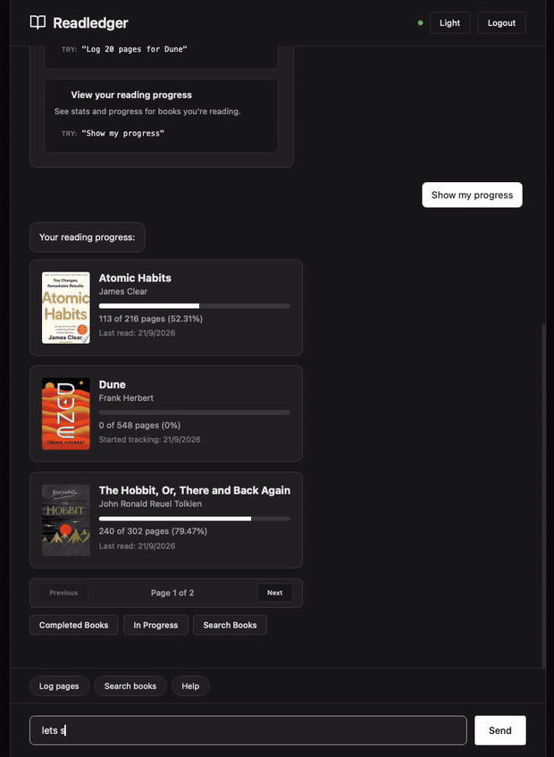
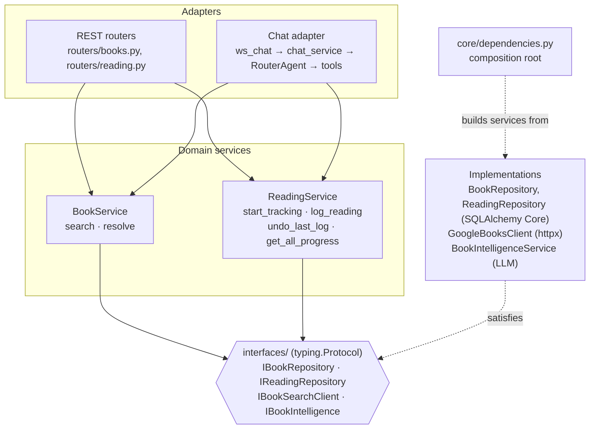
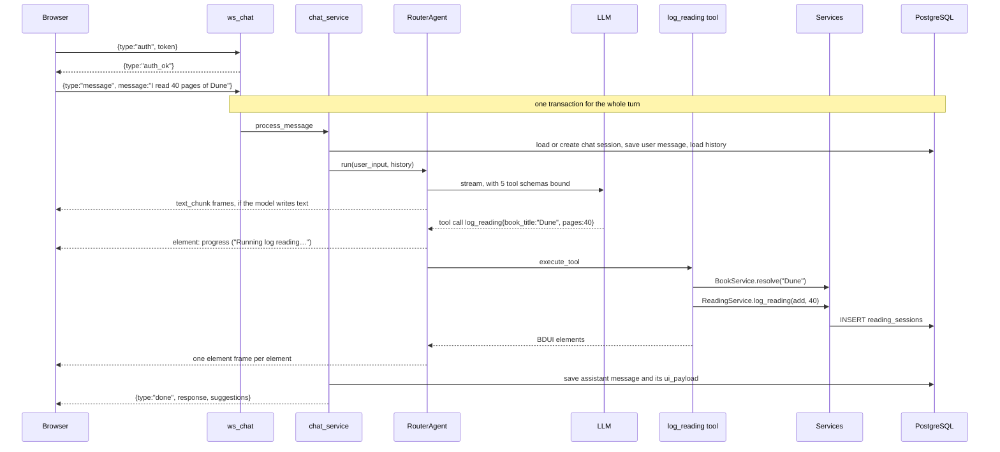
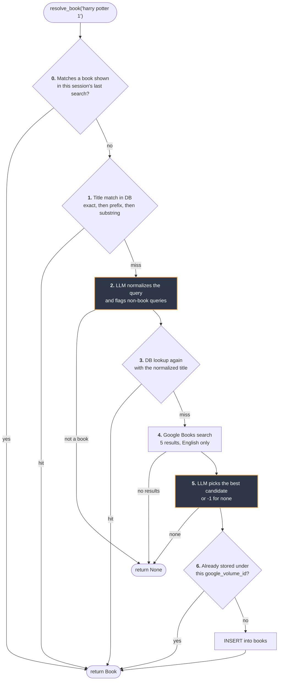

# ReadLedger

A reading tracker you talk to. An LLM decides which operation a message means; deterministic domain services, shared with a REST API, do the work.



Full demo (90s): <!-- upload MP4 via GitHub web editor -->

## What it does

- Logs reading from plain sentences: *"read 40 pages of Dune"*, *"I'm at 25% of Sapiens"*, *"undo that"*.
- Resolves loose titles like *"harry potter 1"* to one specific Google Books volume, and stores it in a shared catalogue.
- Answers progress questions: *"show my progress"*, *"which book am I closest to finishing?"*, *"what did I read most recently?"*.
- Searches by author, title or topic: *"books by Ayn Rand"*, *"books about stoicism"*.
- Streams replies over a WebSocket as typed UI elements (progress cards, book lists, buttons) that a React client renders.
- Exposes the same operations as a REST API, documented at `/docs`.

## Quickstart

Prerequisites: Docker with Compose, an Azure OpenAI deployment or an OpenAI API key, and a Google Books API key.

```bash
git clone https://github.com/rohitxseth/readledgerx.git
cd readledgerx
cp backend/.env.example backend/.env
```

Edit `backend/.env`:

| Variable | What to set |
|----------|-------------|
| `JWT_SECRET_KEY` | Required. The backend refuses to start with the placeholder or with anything shorter than 32 characters. Generate one: `python3 -c "import secrets; print(secrets.token_urlsafe(32))"` |
| `AZURE_OPENAI_ENDPOINT`, `AZURE_OPENAI_API_KEY`, `AZURE_OPENAI_DEPLOYMENT` | Your Azure OpenAI values. To use OpenAI instead, delete these three lines, then uncomment `OPENAI_API_KEY` and set it (it must start with `sk-`). The placeholders are non-empty, so leaving them in selects Azure. |
| `GOOGLE_BOOKS_API_KEY` | A key from a Google Cloud project with the Books API enabled. Google rejects the placeholder value, and keyless requests share a public daily quota that runs out, so search is unreliable without a key. |

Then start everything:

```bash
docker compose up --build
```

This starts PostgreSQL (the schema in `backend/init_db.sql` is applied on first start), the API on port 8000 and the frontend on port 5173. Open <http://localhost:5173>, register an account and start typing.

- Health check: `curl localhost:8000/health` returns `{"status":"healthy","database":"connected"}`
- REST API docs: <http://localhost:8000/docs>

<details>
<summary>Run the backend and frontend on the host instead</summary>

Requires Python 3.12+, [uv](https://docs.astral.sh/uv/) and Node 18+. The default `DATABASE_URL` in `.env.example` already points at the Compose database on `localhost:5433`.

```bash
docker compose up -d postgres-db

cd backend
uv sync
uv run uvicorn app.main:app --reload --port 8000
```

In a second terminal:

```bash
cd frontend
npm install
npm run dev
```

</details>

## Architecture

The chat agent is a routing layer over domain services that know nothing about chat. `BookService` and `ReadingService` hold the rules for books and reading, and import nothing chat-related, SQL or HTTP. The REST routers and the chat agent are two adapters over them: each parses its input, calls a service and renders the result.

The LLM is used in two places only: routing a message to an operation, and two stages of book resolution that run after plain string matching has failed.

### Layers and the composition root



- Services type every dependency as a Protocol. `BookService` takes an `IBookRepository`, an `IBookSearchClient` and an `IBookIntelligence`; it never sees a database connection or an LLM client.
- `app/core/dependencies.py` is the one composition root. It is the only module that constructs repositories, the Google Books client, the LLM client, the password hasher and the token service, and `tests/test_architecture.py` fails if any other module in `app/` does. REST routes receive services through FastAPI `Depends`; the chat adapter calls the same provider functions with the turn's connection.
- Tests replace each Protocol with an in-memory fake, most of them in `tests/conftest.py`. None of the fakes import the interface they satisfy.

The two adapters map onto the same service calls:

| Operation | REST | Chat tool | Service call |
|-----------|------|-----------|--------------|
| Search | `GET /books/search?q=` | `search_books` | `BookService.search` |
| Track a book | `POST /books/track` | `start_tracking` | `BookService.resolve` → `ReadingService.start_tracking` |
| Log pages | `POST /reading/log` | `log_reading` | `BookService.resolve` → `ReadingService.log_reading` |
| Undo last entry | `DELETE /reading/last` | `undo_last_log` | `ReadingService.undo_last_log` |
| Progress | `GET /progress` | `show_progress` | `ReadingService.get_all_progress` |

A rule violation reads the same through both. Logging 500 pages of a 412-page book returns `400` with *"'Dune' only has 412 pages left (0/412 read). Try logging 412 pages instead."* over REST, and that sentence as the chat reply. `tests/test_adapter_equivalence.py` runs every operation through both adapters against identical fakes and asserts the same service calls, the same resulting state and the same result or error message.

The API also has `/auth/register`, `/auth/login`, `/chat/sessions`, `/chat/history`, and `POST /chat/message`, which runs one chat turn without streaming. Every API route except `/auth/*` and `/health` requires `Authorization: Bearer <JWT>`; the WebSocket takes the token in its first frame.

### One chat turn



Before calling the LLM, `RouterAgent` answers a few fixed requests itself: "help", recommendation requests, and the search-prompt buttons. If the model replies with text instead of a tool call, the text becomes a single text element.

### Book resolution: a six-stage pipeline

`BookService.resolve_book` turns a loose title into one stored book. Stages run cheapest first, and the LLM is consulted only after a plain database lookup has failed. It never produces a book directly: stage 5 returns an index into real search results, or -1.



- Stage 0 runs before the six stages. If the user searched for *"ayn rand"* and then types *"The Fountainhead"*, they get the exact volume they were shown, not an edition the pipeline picks independently with a different page count.
- Stages 1 and 3 check the shared catalogue before going to Google. A title that matches a stored book at stage 1 costs one database query, with no LLM or HTTP call. Stage 3 catches titles that match only after normalization.
- Stage 6 deduplicates on `google_volume_id` (a `UNIQUE` column), not on title, so different phrasings of the same book converge on one row.
- The two LLM stages (highlighted) degrade instead of failing. With no credentials, or if the call errors, stage 2 uses the raw query and stage 5 takes the first result.
- A request that carries a volume id skips the pipeline: `BookService.resolve` looks the id up directly. The id comes from the REST `google_volume_id` field or from a chat button for a specific book.

### BDUI protocol

The backend returns a typed element tree, not markdown. `frontend/src/components/BduiRenderer.jsx` switches on `element.type`: `text`, `composite`, `book_list`, `book_progress`, `action_buttons`, `progress`, `help_card`. The reply to *"log 40 pages of dune"* (progress data trimmed):

```json
{
  "type": "composite",
  "elements": [
    { "type": "text", "style": "success", "content": "Logged **40 pages** of **'Dune'**." },
    { "type": "book_progress",
      "data": { "title": "Dune", "pages_read": 40, "total_pages": 412, "progress_percentage": 9.71 } },
    { "type": "action_buttons", "layout": "horizontal", "buttons": [
        { "label": "Log More Pages", "action": "log_reading", "variant": "primary",
          "payload": { "book_title": "Dune", "google_books_id": "<volume id>" } },
        { "label": "Show All Progress", "action": "show_progress", "variant": "secondary", "payload": {} }
    ]}
  ]
}
```

A button click goes back over the same WebSocket as an `action_click` message and takes the same path through `RouterAgent` as typed text. The payload's `google_books_id` makes the click resolve that exact volume. Each assistant reply is stored with its element tree in `chat_messages.ui_payload`.

WebSocket frames for one turn:

```
→ {"type":"auth","token":"<JWT>"}
← {"type":"auth_ok","user_id":"…","email":"…"}
→ {"type":"message","session_id":null,"message":"log 30 pages of dune","message_type":"text"}
← {"type":"text_chunk","content":"…"}        zero or more, as the model streams text
← {"type":"element","element":{…}}           one per UI element
← {"type":"done","session_id":"…","response":{…},"suggestions":[…]}
```

`ping` gets `pong`. A failed turn gets `{"type":"error", …}` carrying an error element.

## Engineering decisions

- **Services depend only on Protocols, and one composition root builds everything.** `BookService` and `ReadingService` are constructed from Protocol-typed dependencies and never name a concrete class. `tests/test_architecture.py` enforces both halves. It fails if a module in `services/` imports from `repositories/`, `integrations/` or the LLM-backed `BookIntelligenceService`, and it fails if any module other than `app/core/dependencies.py` constructs one of those implementations. ([DESIGN.md §1](./DESIGN.md#1-protocol-based-dependency-injection), [Composition root](./DESIGN.md#composition-root))
- **Progress is derived from session rows and never stored.** `reading_sessions` has one row per logged entry. Pages read is a `SUM` at query time, and the percentage is computed from that and the book's page count. With no progress column, there is nothing to drift. Undo deletes the newest row, and lowering progress trims or deletes the newest rows. ([§6](./DESIGN.md#6-derived-reading-progress))
- **The audit write shares the registration's transaction.** `/auth/register` writes the user and its `audit_log` row through two repositories on the same request-scoped connection, opened with `engine.begin()`, so both commit or neither does. Login writes `last_login_at` and its audit row the same way. ([Other decisions](./DESIGN.md#other-decisions-worth-naming))
- **One error boundary per chat turn.** `ws_chat` runs each turn in one transaction. Tools turn expected domain errors, such as an unknown book or too many pages, into ordinary replies. Anything unexpected propagates to one `try/except` in `ws_chat`, which rolls back the whole turn (user message, tool writes, assistant reply) and sends an error frame. LLM calls are the exception: the agent retries once if nothing has streamed yet, and the resolution pipeline falls back as described above. Over REST, `main.py` maps the same domain exceptions to 400, 401, 404 and 502. ([Other decisions](./DESIGN.md#other-decisions-worth-naming))
- **Single-pass agent.** The model routes each message once, with no agent loop. Tool results go straight to the user as UI elements and are never fed back to the model. Cost and latency per message don't grow with tool output, and the numbers in cards come from services, never from the model. ([§4](./DESIGN.md#4-langchain-router-agent))

## Known limitations

- **No recommendations.** *"What should I read?"* gets a fixed decline with search suggestions. It is matched before the LLM is called, and `search_books` refuses queries made only of filler words like *"good books"*.
- **No multi-step reasoning.** The model never sees tool results, so it can't act on one. *"Log 40 pages of whatever I read yesterday"* can't be done in one message.
- **Book data follows Google Books.** Search keeps English-language results only, and a volume with no page count is stored as 500 pages, so progress on it is approximate.
- **Past conversations aren't shown in the UI.** A page reload starts a new chat session. `/chat/sessions` and `/chat/history` exist, but the frontend doesn't call them.
- **No token revocation.** JWTs expire after 7 days; logout only removes the token from the browser.
- **Set up for local development only.** The frontend's API URL and the CORS allow-list are hard-coded to localhost, and both containers run dev servers. There are no migrations: `init_db.sql` runs only when the database volume is created.

## Tests

```bash
cd backend
uv run pytest        # 203 tests, about 3 s

cd ../frontend
npm install
npm test             # 8 tests (Vitest + Testing Library)
```

The backend suite needs no database, network, LLM or `.env`. Repositories, the Google Books client and the LLM are in-memory fakes, and the REST routes and the WebSocket handler run in-process.

| Area | Tests |
|------|------:|
| Chat agent, tools and turn handling | 92 |
| Domain services (`BookService`, `ReadingService`) | 55 |
| REST and chat adapter equivalence | 24 |
| Auth (service and routes) | 20 |
| Mappers | 9 |
| Architecture (import and construction rules) | 3 |

## Tech stack

| Layer | Technology |
|-------|------------|
| API | Python 3.12, FastAPI (async), WebSocket streaming |
| Database | PostgreSQL 15, SQLAlchemy Core, asyncpg |
| LLM | LangChain with Azure OpenAI or OpenAI (tool calling, structured output) |
| Auth | JWT (python-jose), bcrypt |
| External data | Google Books API via httpx |
| Frontend | React 18, Vite |
| Tooling | uv, pytest, pytest-asyncio, Vitest, Docker Compose |

## Project structure

```
backend/app/
  routers/        REST and WebSocket endpoints
  chat/           RouterAgent, tool schemas and handlers, BDUI builders, chat persistence
  services/       BookService, ReadingService, AuthService, BookIntelligenceService (LLM)
  interfaces/     Protocol definitions
  repositories/   SQLAlchemy Core queries
  integrations/   Google Books client
  domain/         mappers from DB rows and API responses to models
  schemas/        Pydantic models
  core/           composition root (dependencies.py), domain exceptions
  config/         settings, LLM provider selection
backend/tests/    pytest suite; in-memory fakes in conftest.py
frontend/src/
  components/     ChatPage, BduiRenderer, cards
  hooks/          useChatWebSocket (auth, reconnect, ping, stream assembly)
  services/       auth API calls
  config/         API and WebSocket URLs
  styles/         CSS
docs/             demo GIF
```

## Further reading

[DESIGN.md](./DESIGN.md) covers each decision in more depth, including what it costs and when I would change it.
