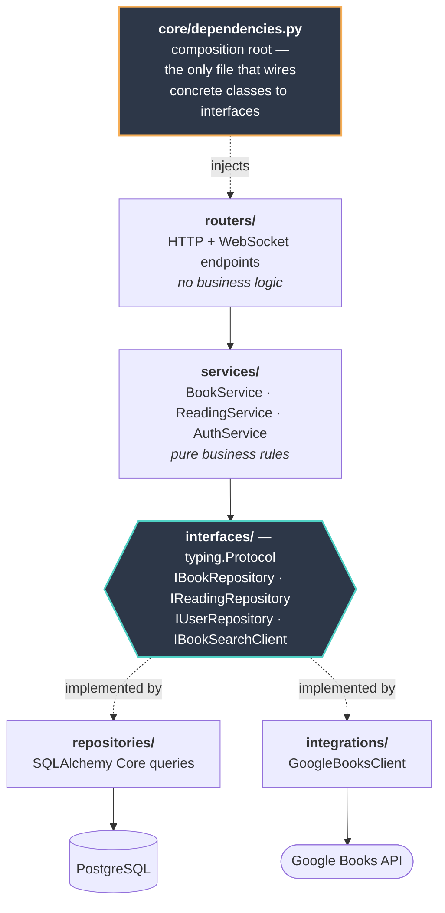
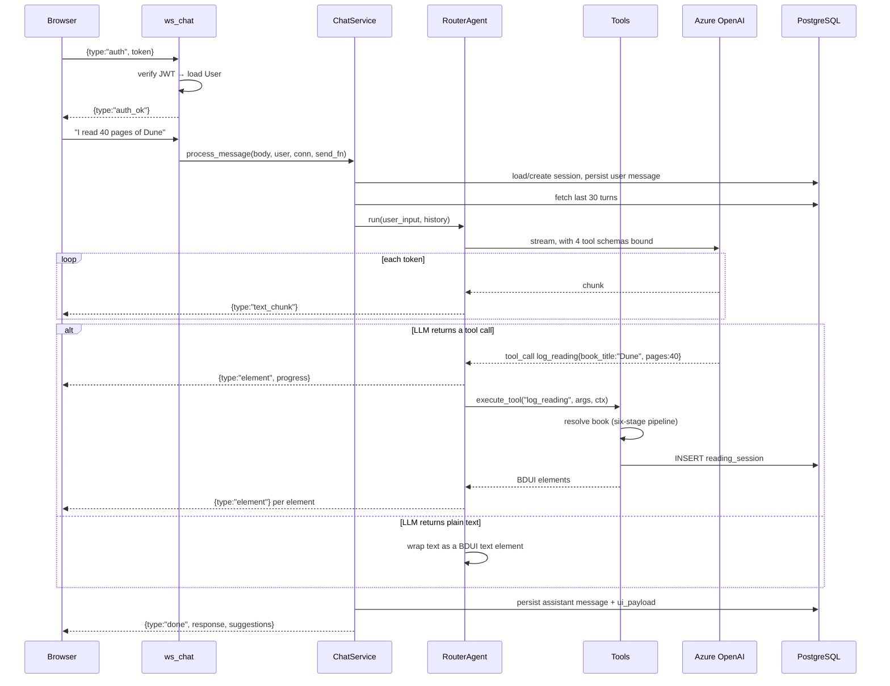
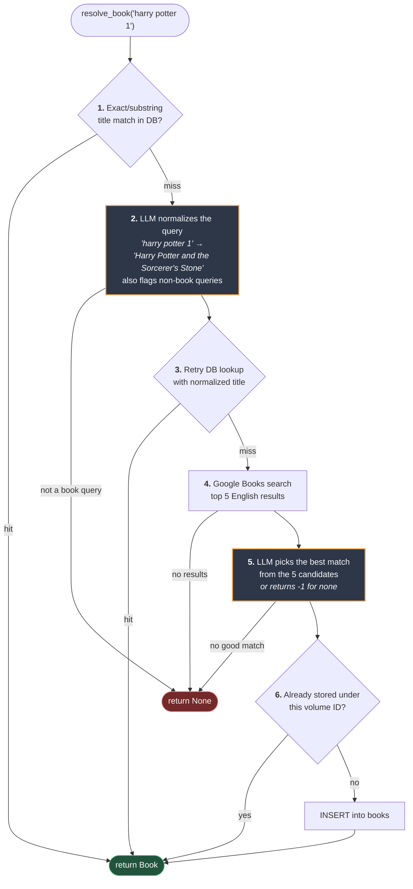

# ReadLedger

**A reading tracker you talk to.** Tell it *"I read 40 pages of Dune last night"* and it finds the book, logs the pages, and streams back a progress card — no forms, no dropdowns.

---

<!-- ─────────────────────────────────────────────────────────────────────
     TODO: ADD SCREENSHOT OR GIF HERE

     Record a ~15s GIF of a real chat turn. The sequence that shows the
     most in the least time:
       1. Type "I read 40 pages of Dune"
       2. Let the streaming text render live
       3. Let the progress card and action buttons appear

     Save it to docs/demo.gif, then replace this whole comment block with:
         

     Keep it under 5 MB so GitHub renders it inline.
     ───────────────────────────────────────────────────────────────────── -->

> **[ Screenshot / demo GIF goes here — see the comment above ]**

---

## What it does

- **Log reading in plain English** — *"read 40 pages of Dune"*, *"I'm at 25% of Sapiens"*, *"undo that"*
- **Resolves fuzzy book titles** — *"harry potter 1"* becomes the right Google Books volume, via a six-stage pipeline that puts the LLM only where deterministic matching fails
- **Tracks progress** — pages read and percent complete, per book or across the whole shelf
- **Streams over WebSocket** — LLM tokens render as they arrive
- **Renders backend-driven UI** — the server returns UI element trees (progress cards, buttons); the React client is a dumb renderer

## Quickstart

**Prerequisites:** Docker, and an Azure OpenAI or OpenAI API key. For the local (non-Docker) path you also need Python 3.12+, [uv](https://docs.astral.sh/uv/), and Node 18+.

### 1. Clone and configure

```bash
git clone https://github.com/rohitxseth/readledgerx.git
cd readledgerx
cp backend/.env.example backend/.env
```

Open `backend/.env` and set, at minimum:

| Variable | Why it matters |
|----------|----------------|
| `JWT_SECRET_KEY` | **Required.** Without it the app falls back to a hardcoded default and anyone can forge a login token. Generate one with `python -c "import secrets; print(secrets.token_urlsafe(32))"` |
| `AZURE_OPENAI_ENDPOINT`, `AZURE_OPENAI_API_KEY`, `AZURE_OPENAI_DEPLOYMENT` | Without these, chat replies *"AI service is not configured"*. All three are needed together. |

`GOOGLE_BOOKS_API_KEY` is optional — search works unauthenticated at low volume.
Set `OPENAI_API_KEY` instead of the Azure trio to use OpenAI directly.

### 2. Run everything with Docker

```bash
docker compose up --build
```

That starts PostgreSQL (schema from `backend/init_db.sql` applies automatically on
first boot), the API on **:8000**, and the frontend on **:5173**.

Open <http://localhost:5173>, register an account, and start chatting.
Health check: `curl localhost:8000/health` → `{"status":"healthy","database":"connected"}`

<details>
<summary>Prefer to run the backend on your host?</summary>

```bash
docker compose up postgres-db -d      # database only, on :5433

cd backend
uv sync
uv run uvicorn app.main:app --reload --port 8000

cd ../frontend
npm install && npm run dev
```

The default `DATABASE_URL` in `.env.example` already points at `localhost:5433`,
so this works with no further changes. Interactive API docs: <http://localhost:8000/docs>

</details>

### Running the tests

```bash
cd backend
uv run pytest            # 56 tests, ~2s, no database and no network required
```

Every test is a unit test. Repositories and the Google Books client are swapped for
in-memory fakes that satisfy the same `typing.Protocol` interfaces as the real
implementations — which is the practical payoff of the design below.

## Architecture

### The layering

Each layer depends only on the layer beneath it, and always through an interface.
Concrete classes are named in exactly one file — `app/core/dependencies.py`, the
composition root.



Because `services/` only ever names a Protocol, a test can hand `BookService` an
in-memory dict instead of a database and the service cannot tell the difference.

### One chat turn, end to end



The agent loop is deliberately **single-pass**: the LLM gets one chance to call tools,
and tool results are returned to the user rather than fed back for a second LLM turn.
That bounds latency and cost per message at the price of multi-step reasoning —
a trade-off discussed in [DESIGN.md](./DESIGN.md#6-langchain-router-agent).

### The six-stage book resolution pipeline

Turning *"harry potter 1"* into a specific Google Books volume is the hardest problem
in the app. The pipeline is ordered so that **the cheapest, most deterministic step runs
first** and the LLM is consulted only when plain matching has already failed.



Two things this buys:

- **Stages 1 and 3 are a cache.** A title anyone has already looked up costs one
  indexed query — no LLM call, no HTTP call.
- **Stage 6 deduplicates on `google_volume_id`, not on title.** The books table is a
  shared canonical catalogue, so two users who phrase the same book differently
  converge on one row.

The LLM steps (2 and 5, highlighted) both degrade gracefully: if no credentials are
configured, stage 2 passes the raw query through and stage 5 falls back to the first
search result. Book resolution keeps working without an LLM — it just gets dumber.

### The BDUI protocol

The backend does not return markdown for the client to interpret. It returns a typed
element tree, and the React `BduiRenderer` switches on `element.type`:

```json
{
  "type": "composite",
  "elements": [
    { "type": "text", "content": "Logged **40 pages** of *Dune*.", "style": "success" },
    { "type": "book_progress", "data": { "title": "Dune", "pages_read": 40,
                                         "total_pages": 412, "progress_percentage": 9.71 } },
    { "type": "action_buttons", "buttons": [
        { "label": "Log More Pages", "action": "log_reading",
          "variant": "primary", "payload": { "book_title": "Dune" } }
    ]}
  ]
}
```

Element types the backend emits: `text`, `composite`, `book_card`, `book_list`,
`book_progress`, `action_buttons`, `progress`, `help_card`.

The loop closes on itself: a button carries an `action` and a `payload`, and clicking it
sends a `message_type: "action_click"` frame back. The agent treats that as just
another user turn, so **buttons and typing go down exactly one code path** — there is no
separate command API behind the UI.

Over the WebSocket, one turn looks like this:

```
Client → {"type":"auth","token":"<JWT>"}
Server → {"type":"auth_ok","user_id":"...","email":"..."}

Client → {"type":"message","session_id":"...","message":"log 30 pages of dune"}
Server → {"type":"text_chunk","content":"Sure"}        # repeated as tokens stream
Server → {"type":"element","element":{...}}            # repeated per BDUI element
Server → {"type":"done","response":{...},"suggestions":[...]}
```

### Progress is event-sourced

There is no `progress` column anywhere. `reading_sessions` is the fact table — one row
per *"I read N pages on date D"* — and every number the UI shows is a `SUM` over those
rows joined against the book's page count. Storing a running total would mean two
sources of truth that can drift; deriving it means they cannot.
[DESIGN.md](./DESIGN.md#8-event-sourced-reading-progress) covers what this costs as well
as what it buys.

## Tech stack

| Layer | Technology |
|-------|-----------|
| API | FastAPI (async), WebSocket streaming |
| Database | PostgreSQL 15, SQLAlchemy Core + asyncpg |
| LLM | LangChain + Azure OpenAI / OpenAI (tool calling, structured output) |
| Auth | JWT (python-jose), bcrypt (Argon2 available) |
| External data | Google Books API |
| Frontend | React 18 + Vite |
| Tooling | uv, pytest + pytest-asyncio, Docker Compose |

## API

| Endpoint | Method | Description |
|----------|--------|-------------|
| `/auth/register` | POST | Register with email + password |
| `/auth/login` | POST | Login, returns JWT |
| `/chat/ws` | WS | Streaming chat (primary interface) |
| `/chat/message` | POST | Single-turn chat, non-streaming |
| `/chat/sessions` | GET | List chat sessions |
| `/chat/history` | GET | Message history for a session |
| `/health` | GET | Liveness + DB reachability |

## Design decisions

[**DESIGN.md**](./DESIGN.md) explains the reasoning behind each choice, including the
trade-offs and what would change at production scale.

| Decision | Why |
|----------|-----|
| [Protocol over ABC](./DESIGN.md#1-protocol-based-dependency-injection) | Test fakes satisfy the interface without importing production code |
| [Composition root](./DESIGN.md#composition-root) | One file knows concrete classes; everything else sees interfaces |
| [Event-sourced progress](./DESIGN.md#8-event-sourced-reading-progress) | Progress is derived, so it cannot drift from its own history |
| [Backend-driven UI](./DESIGN.md#7-backend-driven-ui-bdui) | New chat widgets ship as a backend change plus one renderer case |
| [Six-stage resolution](./DESIGN.md#9-the-book-resolution-pipeline) | LLM calls only where deterministic matching has already failed |
| [Domain mappers](./DESIGN.md#2-domain-mappers) | DB column renames stay contained to one file |
| [Value objects](./DESIGN.md#3-value-objects) | Invalid page counts and emails fail at construction, not at the DB |
| [Event bus](./DESIGN.md#5-event-bus) | Audit logging subscribes to registration instead of being called by it |

<details>
<summary>Project structure</summary>

```
backend/app/
├── chat/           # RouterAgent, tool implementations, BDUI helpers, session manager
├── config/         # Settings, LLM provider selection, logging
├── core/           # Composition root (dependencies.py), domain exceptions
├── domain/         # Mappers, value objects
├── events/         # In-process event bus, user events, handlers
├── integrations/   # Google Books client
├── interfaces/     # Protocol definitions
├── repositories/   # SQLAlchemy Core queries
├── routers/        # FastAPI route handlers
├── schemas/        # Pydantic request/response models
└── services/       # Business logic

frontend/src/
├── components/     # ChatPage, BduiRenderer, cards
├── hooks/          # useChatWebSocket (reconnect, ping, stream accumulation)
└── services/       # auth
```

</details>
